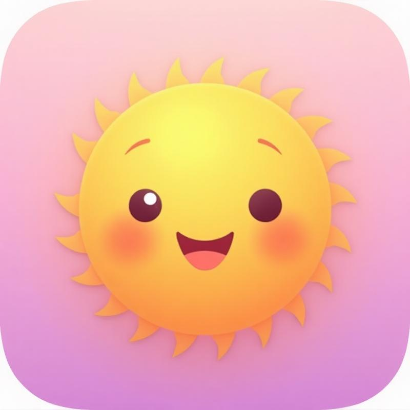

# 🌟 BrightDay - Smart Calendar App

A beautiful, gamified calendar application built with React, TypeScript, and Tailwind CSS. BrightDay helps you plan ahead, stay organized, and achieve your goals with engaging progress tracking and achievements.

## ✨ Features

### 📅 Smart Calendar
- **Multiple Views**: Daily, weekly, and monthly calendar views
- **Smooth Navigation**: Intuitive swipe gestures and animations
- **Color-coded Events**: Different colors for work, class, meetup, and personal events
- **Emoji Support**: Fun emoji tags for visual organization

### 🎯 Gamification
- **Points System**: Earn points for planning ahead (+10) and completing events (+25)
- **Streak Tracking**: Build and maintain planning streaks
- **Achievement Badges**: Unlock badges for reaching milestones
- **Level Progression**: Advance through levels based on total points
- **Visual Feedback**: Confetti animations and haptic feedback for achievements

### 📊 Progress Tracking
- **Personal Dashboard**: View your stats, upcoming events, and achievements
- **Streak Counter**: Track consecutive days of planning
- **Badge Collection**: Collect and display earned achievements
- **Level System**: Progress through levels as you use the app

### 🎨 Modern Design
- **Pastel Gradients**: Beautiful color palette inspired by modern mobile apps
- **Rounded Typography**: Clean, friendly Poppins font
- **Smooth Animations**: Engaging microinteractions and transitions
- **Mobile-First**: Optimized for mobile devices with responsive design
- **Glassmorphism**: Modern card designs with backdrop blur effects

## 🚀 Event Types

- **💼 Work** - Professional meetings and tasks (Sky Blue)
- **📚 Class** - Educational activities and learning (Lavender)
- **☕ Meetup** - Social gatherings and networking (Peach)
- **🧘‍♀️ Personal** - Self-care and personal activities (Soft Yellow)

## 🏆 Achievement System

### Badges Available:
- **📅 Early Planner** - Plan an event 1 week in advance
- **🔥 Streak Master** - Maintain a 7-day planning streak
- **🦋 Social Butterfly** - Create 5 meetup events
- **🎯 Goal Getter** - Complete 50 events

### Points System:
- Planning ahead: +10 points
- Completing events: +25 points
- Early planning (1+ week): +20 bonus points
- Daily streak bonus: +5 points

## 🛠 Tech Stack

- **Frontend**: React 18 + TypeScript
- **Styling**: Tailwind CSS + Custom Design System
- **UI Components**: shadcn/ui + Custom Components
- **State Management**: React Hooks + Local Storage
- **Animations**: CSS animations + Framer Motion
- **Icons**: Lucide React
- **Build Tool**: Vite
- **Package Manager**: npm

## 📱 Mobile Experience

BrightDay is designed as a Progressive Web App (PWA) that can be:
- Installed on mobile devices
- Used offline with cached data
- Enhanced with haptic feedback
- Optimized for touch interactions

## 🔮 Future Features

- **Social Features**: Share events with friends, group planning
- **Poll System**: Vote on meetup times
- **Chat Integration**: Event-specific chat threads
- **Cloud Sync**: Cross-device synchronization
- **Calendar Integration**: Sync with Google Calendar, Apple Calendar
- **Notifications**: Smart reminders and alerts
- **Analytics**: Detailed productivity insights
- **Themes**: Customizable color schemes

## 🎯 Design Philosophy

BrightDay follows these design principles:
- **Delightful**: Every interaction should bring joy
- **Intuitive**: Zero learning curve for basic features
- **Motivating**: Gamification encourages consistent use
- **Beautiful**: Aesthetics matter for daily-use apps
- **Fast**: Smooth performance on all devices

## 📄 License

This project is part of the Lovable platform ecosystem.

---

Made with ❤️ using [Lovable](https://lovable.dev) - The fastest way to build beautiful web apps.